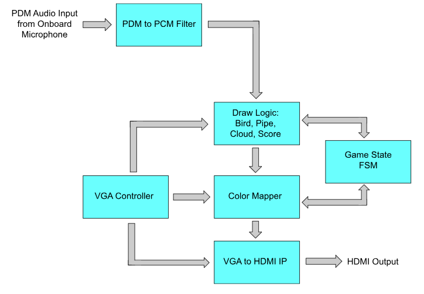
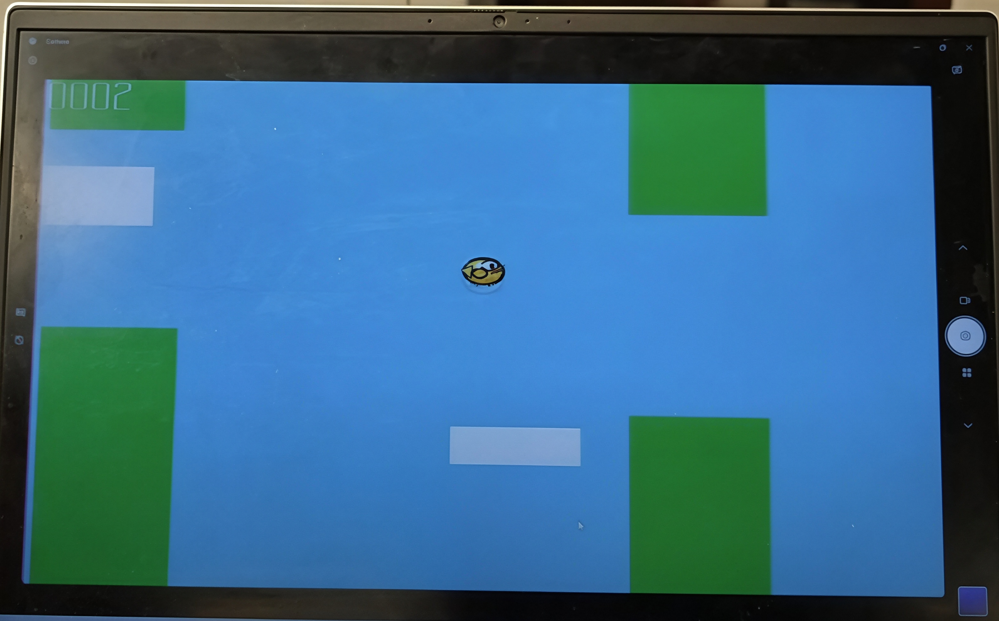

# Clap Controlled Flappy Bird
## Overview
This project implements a clap-activated Flappy-Bird-inspired game. The game runs on a Spartan 7 FPGA and is displayed using the HDMI output on the [Urbana Board](https://www.realdigital.org/hardware/urbana). The key feature of the game is that you must make a loud noise, such as a clap or snap, near the board's microphone to trigger the bird to jump. The goal of the game is to jump through green pipes which appear starting at the right of the screen and move left. There are also clouds which move from the right to the left of the screen to create added realism. The pipes and clouds both use pseudo-random number generators to determine some of their parameters including but not limited to the height for the pipes and the size of the clouds. The score is displayed on the screen in decimal format.

The design implements the game entirely in hardware on the Urbana board, utilizing the onboard microphone chip for sound input. The input is used to control the bird on the screen, while other hardware modules generate positions for other objects. An FSM controls the state of the game, and the score is tracked using the positions of the pipes. All of this information is combined to generate a VGA signal that describes the graphics on the screen, which is then converted to HDMI by the RealDigital IP for display on a monitor.

## Implementation Details
A high level block diagram of the design is shown below. It includes audio processing logic, game state logic, and graphics logic.

### Microphone Input, PDM to PCM Conversion, and Clap Detection
The design utilizes the Urbana board’s onboard TDK T3902 MEMS microphone chip to get the sound input from the user. This microphone encodes the sound amplitude as a 1-bit digital pulse density modulation (PDM) signal, where a higher density of 1s corresponds to a higher amplitude. The microphone produces a new sample on each cycle of a roughly 3 MHz clock, which is generated by dividing the 100 MHz system clock. The circuit then passes the signal through a PDM to PCM conversion filter, which encodes the amplitude of the audio signal as binary numbers rather than bit densities. This is implemented with a simple accumulator which counts the number of 1 bits in the PDM signal within a 64 bit window. Once the PCM value is obtained, a “clap” is detected by checking for the absolute value of the PCM signal to be greater than a threshold value of 4, and this clap signal is sent to the game logic as an input. This works for clap detection because the density of the PDM signal from the microphone varies with the magnitude of the analog audio signal. The threshold value of 4 is arbitrary and is an adjustable parameter. We chose 4 because it seemed to work well during our testing.

### VGA Signal Generation and HDMI Conversion
The graphics are generated with the help of a VGA controller module, which sweeps the draw pointer (drawX, drawY) over an 800 x 525 grid in raster order, updating on every positive edge of the 25 MHz pixel clock. It also indicates when the end of a row has been reached using a horizontal sync signal and when the end of a full frame has been reached using a vertical sync (both active low). It also indicates when the draw pointer is in the frame of the image (640 x 480) and when it's in the blanking interval. Once the VGA signal has been created from the outputs of this module and the color mapping logic discussed below, the output is converted to HDMI by the [RealDigital VGA-to-HDMI Converter IP Core](https://www.realdigital.org/doc/715356000ec89fbfd26a44cd2444659b), which allows it to be displayed on a monitor via the Urbana board's onboard HDMI output port.

### Draw Logic for Bird
The bird's position is computed by separate logic that factors in both the clap input as well as simulated "gravity", which adds a constant positive (downward) amount to the bird’s Y velocity in each frame. This creates an acceleration that imitates real-world gravity. When the user jumps, the ball receives an initial upward velocity, but as gravity continues to act it eventually falls back down. The logic also implements some checks for the top and bottom of the screen to ensure the bird does not go out of the frame. Once the position is determined, the pixel color is selected based on the location of the draw pointer and the game state. If the state is dead, then the bird is just drawn as a red circle. Otherwise, it is drawn from a 32x32 bit bird image stored in distributed LUT RAM, and the appropriate pixel is chosen based on DrawX and DrawY. The address in the RAM is calculated by determining the pixel’s relative row-major position in the bitmap based on both the bird position and the draw pointer position. Specifically, the relative X and Y coordinates can be calculated using the equations DrawX - (BallX-Ball_size) and DrawY - (BallY-Ball_size), respectively, the row major index can be found using relative_y_coord*32 + relative_x_coord, and the 12-bit color value can be obtained from the lookup table at that index.

### Draw Logic for Pipes and Clouds
The logic to generate the positions for both the pipes and the clouds makes use of pseudo-random number generation using linear feedback shift registers. The random number generator uses XOR feedback into a shift register, with the location of the feedback bits determined by a set of complete polynomials. This generates a pseudorandom sequence that causes this shift register to cycle through all nonzero 8-bit values. A different seed is given to each random number generator used to provide more randomness. The pipes utilize random number generators for the height of the pipes, while the clouds use them for the height, width, and elevation of each cloud. Both the cloud and pipe logic display 2 objects on screen at a time, and each is shifted right to left at a constant speed until it leaves the frame, after which it returns to the other side to create the appearance of a new object. The pipes move faster than the clouds to create the illusion of depth on the screen. Once the position and size of the pipes and cloud are computed, the color mapper determines how they should be displayed. The pipe position keeps track of the left edge of the bottom half of the pipe, and the color mapper determines whether a pixel is part of the pipe based on whether (DrawX, DrawY) is within the bounds of the pipe based on its position and the width and gap size (which are set as fixed parameters). The clouds work similarly, but they are simple rectangles and the position keeps track of the top left corner, which can be used in conjunction with the height and width to specify whether a pixel is part of the cloud. If a pixel is in the pipe, it is drawn green, and if it is in the cloud is drawn white. Otherwise (if it is also not part of the bird or score), it is drawn in the background color of sky blue. The bird and pipes appear in front of the clouds when they overlap.

### Score Calculation and Display
The player’s score for the game is tracked by a simple counter. Each time a pipe passes the middle of the screen, the counter is incremented, and it is reset after the player dies and starts a new game. The binary value of the counter is converted to decimal using a standard “double dabble” BCD algorithm, which allows it to be displayed on the screen. This algorithm works by shifting in the MSB of the binary into the LSB of the BCD one bit at a time, then adding 3 to any nibble greater than 5. This added 3 becomes 6 when multiplied by 2 (left shifted), which accounts for the difference between base 16 and base 10 digits. The score is displayed when the draw pointer (DrawX, DrawY) is in the top left corner of the screen, and the pixel values are determined using 16x32 bitmaps for each digit 0-9 stored in distributed LUT RAM. Which place of the four digits is determined using the equation digit_place = 2'd3 - DrawX / 16. The value of the digit in that place is then selected from the score (in BCD format) using the equation digit = score_bcd[digit_place*4 +: 4]. Finally, the 16 bit row is taken out from the digit bitmaps lookup table using row = digits_bitmaps[digit*32+DrawY], and the specific bit is selected using bit = row[15-(DrawX % 16)], similar to lab 7. If the bit is 1, the pixel is displayed as white; if it’s 0, the logic draws as normal, displaying the pipe or background as appropriate, which creates a transparent background for the score. 

### Game State
The game state is tracked using a simple finite state machine that has three states: start, active, and dead. The start state represents the entry state at power on or between games. In this state, the bird “flies” in the middle of the screen and the score remains at 0. There are no pipes, but the clouds continue to move. Once the user claps, the FSM transitions to the active state, which represents the standard game play. In this state, the bird responds to gravity and jumps, the pipes and clouds move across the screen, and the score counts up as the bird passes obstacles. Once the bird collides with a pipe or the bottom of the screen, the FSM transitions to the dead state. A collision is detected when either BallY + BallS >= Y_Max, or if both ball_on and pipe_on are high for any pixel in the frame (this is tracked using a temporary register that is reset for each frame). In the dead state, nothing on the screen moves, the score at death is displayed, and the bird is drawn as a red circle. Once the user claps again, the FSM returns to the start state.

## Resource Utilization
Below is the FPGA resource utilization of the implemented design.
| Resource     | Utilization     |
| ------------- | --------- |
| LUT           | 1013      |
| DSP           | 7         |
| Memory (BRAM) | 0         |
| Flip-Flop     | 409       |
| Static Power  | 0.072 W   |
| Dynamic Power | 0.257 W   |
| Total Power   | 0.329 W   |

The design also meets timing, with a worst negative slack of 2.076 nanoseconds at the 100 MHz system clock frequency.

## Image of Working Game
Below is an image of the HDMI output during gameplay.

## Citations and AI Use
### Linear Feedback Shift Registers 
The following document was used as a reference to understand the linear feedback shift register method for generating pseudorandom numbers and to select the feedback tap locations for our 8-bit generators.
https://www.physics.otago.ac.nz/reports/electronics/ETR2012-1.pdf 

### Binary to BCD Conversion
The code for the binary to BCD converter used to convert the score in the design was taken from the following website.
https://www.realdigital.org/doc/6dae6583570fd816d1d675b93578203d

### Bird Image
The 32x32 pixel circular image of the bird was generated by OpenAI’s ChatGPT 5.3 in the following conversation.
https://chatgpt.com/share/6a03aa47-2394-83ea-8080-6484aa1afefd 

### Digit Bitmaps
The 16x32 bitmaps for digits 0 to 9 were generated by Anthropic’s Claude Sonnet 4.6 in the following conversation.
https://claude.ai/share/939fbd21-6e5b-4c3d-ba81-7ac785c20559 

## Contributors
- Ben Vishnevskiy
- Timothy Jou

